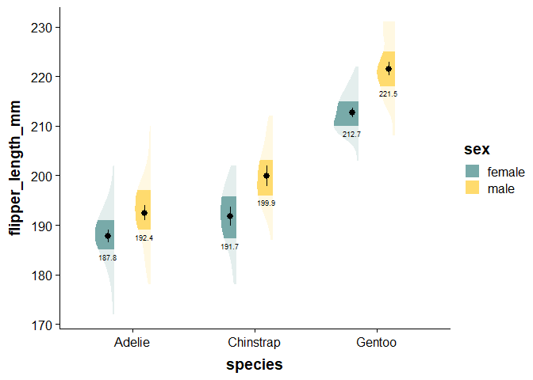
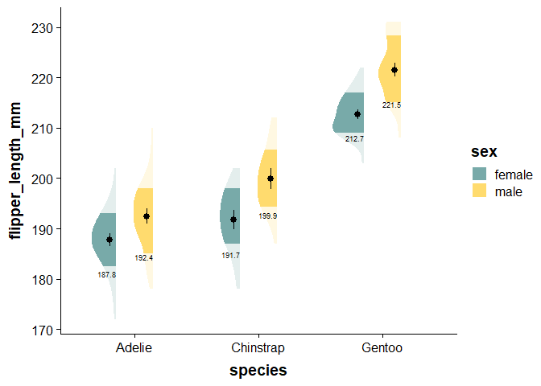

<!-- README.md is generated from README.Rmd. Please edit that file -->

# novahelpers

<!-- badges: start -->
<!-- badges: end -->

Dallas’s miscellanious helper functions, namely for summarizing and
reporting data.

## Installation

You can install the development version of novahelpers from
[GitHub](https://github.com/) with:

``` r
# install.packages("devtools")
devtools::install_github("DallasNovakowski/novahelpers")
```

## Usage

``` r
library(tidyverse)
library(emmeans)
library(palmerpenguins) # dataset

library(novahelpers)
```

Load data

``` r
df <- palmerpenguins::penguins

# drop rows with missing values
df <- df[complete.cases(df)==TRUE, ]
```

## run_summary()

Summarizes our relevant descriptive stats

``` r
flipper_summary <- run_summary(df, c("sex", "species"), "flipper_length_mm")

knitr::kable(flipper_summary)
```

| sex    | species   | missing_count |   n |     mean |  std_dev |        se |     loci |     upci | min | max |    y16 |    y25 |   y50 |    y75 |    y84 |  coef_var |   skewness | kurtosis |
|:-------|:----------|--------------:|----:|---------:|---------:|----------:|---------:|---------:|----:|----:|-------:|-------:|------:|-------:|-------:|----------:|-----------:|---------:|
| female | Adelie    |             0 |  73 | 187.7945 | 5.595035 | 0.6548493 | 186.5110 | 189.0780 | 172 | 202 | 182.52 | 185.00 | 188.0 | 191.00 | 193.00 | 0.0297934 | -0.2983825 | 3.487783 |
| female | Chinstrap |             0 |  34 | 191.7353 | 5.754096 | 0.9868194 | 189.8011 | 193.6695 | 178 | 202 | 187.00 | 187.25 | 192.0 | 195.75 | 198.00 | 0.0300106 | -0.4085811 | 2.680323 |
| female | Gentoo    |             0 |  58 | 212.7069 | 3.897857 | 0.5118136 | 211.7037 | 213.7101 | 203 | 222 | 209.00 | 210.00 | 212.0 | 215.00 | 217.00 | 0.0183250 |  0.2175358 | 2.620230 |
| male   | Adelie    |             0 |  73 | 192.4110 | 6.599317 | 0.7723917 | 190.8971 | 193.9248 | 178 | 210 | 185.00 | 189.00 | 193.0 | 197.00 | 198.00 | 0.0342980 |  0.0399511 | 3.012400 |
| male   | Chinstrap |             0 |  34 | 199.9118 | 5.976559 | 1.0249713 | 197.9028 | 201.9207 | 187 | 212 | 194.28 | 196.00 | 200.5 | 203.00 | 205.72 | 0.0298960 |  0.1802548 | 2.499375 |
| male   | Gentoo    |             0 |  61 | 221.5410 | 5.673252 | 0.7263855 | 220.1173 | 222.9647 | 208 | 231 | 215.00 | 218.00 | 221.0 | 225.00 | 228.40 | 0.0256081 | -0.1079373 | 2.351827 |

Running ANOVA, nothing i take credit for.

``` r
# basic fit
# Setting contrasts
contrasts(df$species) <- contr.sum

contrasts(df$sex) <- contr.sum

# consider just using afex - https://www.rdocumentation.org/packages/afex/versions/1.3-0
#a <- aov_ez("id", "log_rt", fhch, between = "task", within = c("stimulus", "length"))

# Type 3 anova with orthogonal contrasts
flipper_fit <- lm(flipper_length_mm ~ species*sex, data = df)

flipper_anova <- car::Anova(flipper_fit, type = 3)

flipper_emmeans <- emmeans::emmeans(flipper_fit, specs = pairwise ~ species*sex)
```

## merge_emmeans_summary()

Combines our `run_summary()` output with `emmeans` object

``` r
flipper_summary <- merge_emmeans_summary(flipper_summary, flipper_emmeans)
knitr::kable(flipper_summary)
```

| sex    | species   | missing_count |   n |     mean |  std_dev |        se |     loci |     upci | min | max |    y16 |    y25 |   y50 |    y75 |    y84 |  coef_var |   skewness | kurtosis |   emmean | emmean_se | emmean_loci | emmean_upci |
|:-------|:----------|--------------:|----:|---------:|---------:|----------:|---------:|---------:|----:|----:|-------:|-------:|------:|-------:|-------:|----------:|-----------:|---------:|---------:|----------:|------------:|------------:|
| female | Adelie    |             0 |  73 | 187.7945 | 5.595035 | 0.6548493 | 186.5110 | 189.0780 | 172 | 202 | 182.52 | 185.00 | 188.0 | 191.00 | 193.00 | 0.0297934 | -0.2983825 | 3.487783 | 187.7945 | 0.6618982 |    186.4924 |    189.0966 |
| female | Chinstrap |             0 |  34 | 191.7353 | 5.754096 | 0.9868194 | 189.8011 | 193.6695 | 178 | 202 | 187.00 | 187.25 | 192.0 | 195.75 | 198.00 | 0.0300106 | -0.4085811 | 2.680323 | 191.7353 | 0.9698693 |    189.8273 |    193.6433 |
| female | Gentoo    |             0 |  58 | 212.7069 | 3.897857 | 0.5118136 | 211.7037 | 213.7101 | 203 | 222 | 209.00 | 210.00 | 212.0 | 215.00 | 217.00 | 0.0183250 |  0.2175358 | 2.620230 | 212.7069 | 0.7425722 |    211.2461 |    214.1677 |
| male   | Adelie    |             0 |  73 | 192.4110 | 6.599317 | 0.7723917 | 190.8971 | 193.9248 | 178 | 210 | 185.00 | 189.00 | 193.0 | 197.00 | 198.00 | 0.0342980 |  0.0399511 | 3.012400 | 192.4110 | 0.6618982 |    191.1088 |    193.7131 |
| male   | Chinstrap |             0 |  34 | 199.9118 | 5.976559 | 1.0249713 | 197.9028 | 201.9207 | 187 | 212 | 194.28 | 196.00 | 200.5 | 203.00 | 205.72 | 0.0298960 |  0.1802548 | 2.499375 | 199.9118 | 0.9698693 |    198.0038 |    201.8197 |
| male   | Gentoo    |             0 |  61 | 221.5410 | 5.673252 | 0.7263855 | 220.1173 | 222.9647 | 208 | 231 | 215.00 | 218.00 | 221.0 | 225.00 | 228.40 | 0.0256081 | -0.1079373 | 2.351827 | 221.5410 | 0.7240820 |    220.1165 |    222.9654 |

## Planned Comparisons

See <https://aosmith.rbind.io/2019/04/15/custom-contrasts-emmeans/> and
<https://cran.r-project.org/web/packages/emmeans/vignettes/comparisons.html#linfcns>
for custom contrasts

``` r
flipper_just_emmeans <- emmeans::emmeans(flipper_fit, specs = ~ species*sex)

# correponds to row numbers in  flipper_just_emmeans
chinstrap_female = c(0, 1, 0, 0, 0, 0)
adelie_female = c(1, 0, 0, 0, 0, 0)

contrast(flipper_just_emmeans, method = list("Adelie female - Chinstrap female" =  adelie_female-chinstrap_female) )
#>  contrast                         estimate   SE  df t.ratio p.value
#>  Adelie female - Chinstrap female    -3.94 1.17 327  -3.356  0.0009
```

## calculate_and_merge_effect_sizes()

Merges raw comparisons and statistical tests with cohen’s d effect
sizes. Currently only does all tukey-adjusted comparisons

``` r
flipper_contrasts  <- calculate_and_merge_effect_sizes(flipper_emmeans, flipper_fit)
#> Since 'object' is a list, we are using the contrasts already present.

knitr::kable(flipper_contrasts)
```

| contrast                          |    estimate |        SE | df_error |     t.ratio |         p |          d |      d_se |   d_ci_low |  d_ci_high |
|:----------------------------------|------------:|----------:|---------:|------------:|----------:|-----------:|----------:|-----------:|-----------:|
| Adelie female - Chinstrap female  |  -3.9407736 | 1.1742043 |      327 |  -3.3561226 | 0.0113141 | -0.6968332 | 0.2094108 | -1.1087955 | -0.2848709 |
| Adelie female - Gentoo female     | -24.9123760 | 0.9947476 |      327 | -25.0439178 | 0.0000000 | -4.4051682 | 0.2461951 | -4.8894943 | -3.9208420 |
| Adelie female - Adelie male       |  -4.6164384 | 0.9360655 |      327 |  -4.9317473 | 0.0000191 | -0.8163086 | 0.1685709 | -1.1479290 | -0.4846883 |
| Adelie female - Chinstrap male    | -12.1172442 | 1.1742043 |      327 | -10.3195367 | 0.0000000 | -2.1426498 | 0.2238977 | -2.5831115 | -1.7021881 |
| Adelie female - Gentoo male       | -33.7464631 | 0.9810219 |      327 | -34.3992957 | 0.0000000 | -5.9672688 | 0.2907559 | -6.5392570 | -5.3952806 |
| Chinstrap female - Gentoo female  | -20.9716024 | 1.2214990 |      327 | -17.1687430 | 0.0000000 | -3.7083350 | 0.2601543 | -4.2201223 | -3.1965476 |
| Chinstrap female - Adelie male    |  -0.6756648 | 1.1742043 |      327 |  -0.5754235 | 0.9925701 | -0.1194754 | 0.2076830 | -0.5280388 |  0.2890879 |
| Chinstrap female - Chinstrap male |  -8.1764706 | 1.3716023 |      327 |  -5.9612547 | 0.0000001 | -1.4458166 | 0.2490378 | -1.9357351 | -0.9558982 |
| Chinstrap female - Gentoo male    | -29.8056895 | 1.2103475 |      327 | -24.6257285 | 0.0000000 | -5.2704356 | 0.2971169 | -5.8549373 | -4.6859339 |
| Gentoo female - Adelie male       |  20.2959376 | 0.9947476 |      327 |  20.4031038 | 0.0000000 |  3.5888595 | 0.2250201 |  3.1461898 |  4.0315293 |
| Gentoo female - Chinstrap male    |  12.7951318 | 1.2214990 |      327 |  10.4749425 | 0.0000000 |  2.2625183 | 0.2334102 |  1.8033432 |  2.7216935 |
| Gentoo female - Gentoo male       |  -8.8340871 | 1.0371635 |      327 |  -8.5175452 | 0.0000000 | -1.5621007 | 0.1933027 | -1.9423745 | -1.1818268 |
| Adelie male - Chinstrap male      |  -7.5008058 | 1.1742043 |      327 |  -6.3879905 | 0.0000000 | -1.3263412 | 0.2140100 | -1.7473513 | -0.9053311 |
| Adelie male - Gentoo male         | -29.1300247 | 0.9810219 |      327 | -29.6935513 | 0.0000000 | -5.1509602 | 0.2658223 | -5.6738977 | -4.6280226 |
| Chinstrap male - Gentoo male      | -21.6292189 | 1.2103475 |      327 | -17.8702550 | 0.0000000 | -3.8246190 | 0.2610972 | -4.3382611 | -3.3109768 |

``` r
# Extract effect size (partial eta squared) from anova
flipper_anova_pes <- effectsize::eta_squared(flipper_anova,
                                             alternative="two.sided",
                                             verbose = FALSE)
# Convert anova table into dataframe
flipper_anova <- data.frame(flipper_anova)


flipper_anova <- flipper_anova[!(rownames(flipper_anova) == "(Intercept)"), ]

# import effect size estimates and confidence intervals to anova dataframe
flipper_anova[1:3,"pes_ci95_lo"] <- flipper_anova_pes$CI_low
flipper_anova[1:3,"pes_ci95_hi"] <- flipper_anova_pes$CI_high
flipper_anova[1:3,"pes"] <- flipper_anova_pes$Eta2

# round all numeric columns to 2 decimal places
flipper_anova <- flipper_anova %>%
  dplyr::mutate_if(is.numeric, function(x) round(x, 2))
```

## report_tidy_anova_etaci()

Used for extracting results from anova table into reportable text

``` r
report_tidy_anova_etaci(flipper_anova, "sex")
#> [1] "<U+03B7>^2^ = 0.27, 95% CI [0.2, 0.35], *F*(1, 327) = 122, *p* < .001"
```

You can use this inline function inline as well, η<sup>2</sup> = 0.27,
95% CI \[0.2, 0.35\], *F*(1, 327) = 122, *p* \< .001

## report_tidy_t()

``` r
flipper_sex_ttest <- t.test(flipper_length_mm ~ sex, data=df) %>%
  report::report() %>%
  data.frame() %>%
  janitor::clean_names()
#> Warning: Unable to retrieve data from htest object.
#>   Returning an approximate effect size using t_to_d().

knitr::kable(flipper_sex_ttest)
```

| parameter         | group | mean_group1 | mean_group2 | difference |   ci |    ci_low |   ci_high |         t | df_error |       p | method                  | alternative |          d |   d_ci_low |  d_ci_high |
|:------------------|:------|------------:|------------:|-----------:|-----:|----------:|----------:|----------:|---------:|--------:|:------------------------|:------------|-----------:|-----------:|-----------:|
| flipper_length_mm | sex   |    197.3636 |     204.506 |  -7.142316 | 0.95 | -10.06481 | -4.219821 | -4.807866 | 325.2784 | 2.3e-06 | Welch Two Sample t-test | two.sided   | -0.5331566 | -0.7539304 | -0.3115901 |

``` r

report_tidy_t(flipper_sex_ttest, teststat = T)
#> [1] "*d* = -0.53, 95% CI [-0.75, -0.31], *t* (325.28) = -4.81, *p* < .001"
```

Works on t-tests, *d* = -0.53, 95% CI \[-0.75, -0.31\], *t* (325.28) =
-4.81, *p* \< .001

… and it works on emmmean contrasts from ANOVA, *d* = -0.82, 95% CI
\[-1.15, -0.48\], *p* \< .001

``` r
report_tidy_t(
                           flipper_contrasts[flipper_contrasts$contrast =="Adelie female - Adelie male",], 
                           italicize = FALSE, 
                           ci = FALSE)
#> [1] "d = -0.82, p < .001"
```

# Putting it Together With a Plot, with theme_basic()

``` r
#Just for this plotting workflow
library(ggpp) # for position_dodge2nudge
library(cowplot)
library(ggdist)
library(ggpubr) # significance brackets
library(ggtext)

# Define color palette
nova_palette <- c("#78AAA9", "#FFDB6E")

ggplot(data = df,
       aes(y = flipper_length_mm, # our dependent/response/outcome variable 
           x = species,  # our grouping/independent/predictor variable
           fill = sex)) +  # our third grouping/independent/interaction variable
    ggdist::stat_slab( alpha = .65,
                     adjust = 2,
                     side = "left", 
                     scale = 0.4, 
                     show.legend = F, 
                     position = position_dodge(width = .6), 
                     .width = c(.50, 1),
                     aes(fill_ramp = after_stat(level))) +
  ## Add stacked dots
  ggdist::stat_dots(alpha = 1,
                    side = "left", 
                    scale = 0.4, 
                    aes(color = sex,
                    fill = sex),

                    position = position_dodge(width = .6)) + 
  geom_text(data = flipper_summary, 
            aes(x = species, 
                y = mean, 
                label = round(mean,1)),
            color="black", 
            size = 2, 
            position = position_dodge2nudge(x = .08, width = .6)) +
    geom_pointrange(data = flipper_summary, # our externally-defined summary dataframe
                  aes(x = species,  # our independent variable
                      y = mean, # our outcome/dependent variable
                      ymin = loci,  # lower-bound confidence interval
                      ymax = upci # upper-bound confidence interval
                  ), 
                  show.legend = F,
                  position = position_dodge2nudge(x= -.03, width = .6)) +
  
  
    scale_colour_manual(values = nova_palette, 
                              aesthetics = c("fill", "color")) +   
  ## define amount of fading
ggdist::scale_fill_ramp_discrete(range = c(0.0, 1),
                                   aesthetics = c("fill_ramp")) + 
       labs(subtitle = paste0("**species**: ", report_tidy_anova_etaci(flipper_anova,"species"), "<br>",
                           "**sex**: ", report_tidy_anova_etaci(flipper_anova,"sex"), "<br>",
                           "**species*sex**: ",report_tidy_anova_etaci(flipper_anova,"species:sex"))
         ) + # add a density slab

  
  ggpubr::geom_bracket(inherit.aes = FALSE, # necessary for factorial design
                       tip.length = 0.02, 
                       vjust = -0.6,
                       xmin = 1.12, # You need to play with these by hand
                       xmax = 1.82, 
                       y.position = 210 ,
                       label.size = 2.1,
                       label = paste0(
                         report_tidy_t(
                           flipper_contrasts[flipper_contrasts$contrast =="Chinstrap female - Adelie male",], 
                           italicize = FALSE, 
                           ci = FALSE)) # content of your bracket text
                       
  ) +
  ggpubr::geom_bracket(inherit.aes = FALSE, 
                       tip.length = -0.02, 
                       vjust = 0.3,
                       xmin = 2.12, 
                       xmax = 3.12, 
                       y.position = 192 ,
                       label.size = 2.1,
                       label = paste0(
                         report_tidy_t(
                           flipper_contrasts[flipper_contrasts$contrast =="Chinstrap male - Gentoo male",], 
                           italicize = FALSE, 
                           ci = FALSE)) # content of your bracket text
  ) +

  theme_basic() +
  guides(fill_ramp = "none")
```


For posterity, here is a plot with just faded density slabs

``` r
ggplot(data = df,
       aes(y = flipper_length_mm, # our dependent/response/outcome variable 
           x = species,  # our grouping/independent/predictor variable
           fill = sex)) +  # our third grouping/independent/interaction variable
    ggdist::stat_slab(
                     side = "left", 
                     scale = 0.5, 
                     position = position_dodge(width = .6), 
                     .width = c(.50, 1),
                     aes(fill_ramp = after_stat(level))) +
  ggdist::scale_fill_ramp_discrete(range = c(0.2, 1),
                                   aesthetics = c("fill_ramp")) + 
      scale_colour_manual(values = nova_palette, 
                              aesthetics = c("fill")) +   
  guides(fill_ramp = "none") +

  geom_text(data = flipper_summary, 
            aes(x = species, 
                y = y25 - .1*sd(df$flipper_length_mm), 
                label = round(mean,1)),
            color="black", 
            size = 2.5, 

            position = position_dodge2nudge(x= -.07, width = .6)) +
    geom_pointrange(data = flipper_summary, # our externally-defined summary dataframe
                  aes(x = species,  # our independent variable
                      y = mean, # our outcome/dependent variable
                      ymin = loci,  # lower-bound confidence interval
                      ymax = upci # upper-bound confidence interval
                  ), 
                  show.legend = F,
                  position = position_dodge2nudge(x= -.05, width = .6)) + 
  theme_basic()
```



Further posterity, fading based on standard deviation

``` r
ggplot(data = df,
       aes(y = flipper_length_mm, # our dependent/response/outcome variable 
           x = species,  # our grouping/independent/predictor variable
           fill = sex)) +  # our third grouping/independent/interaction variable
    ggdist::stat_slab(
                     side = "left", 
                     scale = 0.5, 
                     position = position_dodge(width = .6), 
                     .width = c(.68, 1),
                     aes(fill_ramp = after_stat(level))) +
  ggdist::scale_fill_ramp_discrete(range = c(0.2, 1),
                                   aesthetics = c("fill_ramp")) + 
      scale_colour_manual(values = nova_palette, 
                              aesthetics = c("fill")) +   
  guides(fill_ramp = "none") +

  geom_text(data = flipper_summary, 
            aes(x = species, 
                y = y16 - .07*sd(df$flipper_length_mm), 
                label = round(mean,1)),
            color="black", 
            size = 2.5, 

            position = position_dodge2nudge(x= -.07, width = .6)) +
    geom_pointrange(data = flipper_summary, # our externally-defined summary dataframe
                  aes(x = species,  # our independent variable
                      y = mean, # our outcome/dependent variable
                      ymin = loci,  # lower-bound confidence interval
                      ymax = upci # upper-bound confidence interval
                  ), 
                  show.legend = F,
                  position = position_dodge2nudge(x= -.05, width = .6)) + 
  theme_basic()
```



# many

Often, you may need to run your analysis on multiple variables (e.g.,
mediators). The `many` family of functions lets you designate multiple
dependent variables to run summaries, lm, emmeans, anovas, and merging
emmeans/summaries. These functions each return a list corresponding to
your dependent variable name.

## run_many_summaries()

This is a useful function for running run_summary() over many variables,
and storing them all in one place

``` r

dv_vars <- c("bill_length_mm", "flipper_length_mm", "body_mass_g")
grouping_vars <- c("species", "sex")

summary_list <- run_many_summaries(data = df,
                  summarization_vars = dv_vars,
                  group_vars = grouping_vars)
summary_list
#> $bill_length_mm
#> # A tibble: 6 x 19
#> # Groups:   species [3]
#>   species  sex   missing_count     n  mean std_dev    se  loci  upci   min   max
#>   <fct>    <fct>         <int> <int> <dbl>   <dbl> <dbl> <dbl> <dbl> <dbl> <dbl>
#> 1 Adelie   fema~             0    73  37.3    2.03 0.237  36.8  37.7  32.1  42.2
#> 2 Adelie   male              0    73  40.4    2.28 0.267  39.9  40.9  34.6  46  
#> 3 Chinstr~ fema~             0    34  46.6    3.11 0.533  45.5  47.6  40.9  58  
#> 4 Chinstr~ male              0    34  51.1    1.56 0.268  50.6  51.6  48.5  55.8
#> 5 Gentoo   fema~             0    58  45.6    2.05 0.269  45.0  46.1  40.9  50.5
#> 6 Gentoo   male              0    61  49.5    2.72 0.348  48.8  50.2  44.4  59.6
#> # i 8 more variables: y16 <dbl>, y25 <dbl>, y50 <dbl>, y75 <dbl>, y84 <dbl>,
#> #   coef_var <dbl>, skewness <dbl>, kurtosis <dbl>
#> 
#> $flipper_length_mm
#> # A tibble: 6 x 19
#> # Groups:   species [3]
#>   species  sex   missing_count     n  mean std_dev    se  loci  upci   min   max
#>   <fct>    <fct>         <int> <int> <dbl>   <dbl> <dbl> <dbl> <dbl> <int> <int>
#> 1 Adelie   fema~             0    73  188.    5.60 0.655  187.  189.   172   202
#> 2 Adelie   male              0    73  192.    6.60 0.772  191.  194.   178   210
#> 3 Chinstr~ fema~             0    34  192.    5.75 0.987  190.  194.   178   202
#> 4 Chinstr~ male              0    34  200.    5.98 1.02   198.  202.   187   212
#> 5 Gentoo   fema~             0    58  213.    3.90 0.512  212.  214.   203   222
#> 6 Gentoo   male              0    61  222.    5.67 0.726  220.  223.   208   231
#> # i 8 more variables: y16 <dbl>, y25 <dbl>, y50 <dbl>, y75 <dbl>, y84 <dbl>,
#> #   coef_var <dbl>, skewness <dbl>, kurtosis <dbl>
#> 
#> $body_mass_g
#> # A tibble: 6 x 19
#> # Groups:   species [3]
#>   species  sex   missing_count     n  mean std_dev    se  loci  upci   min   max
#>   <fct>    <fct>         <int> <int> <dbl>   <dbl> <dbl> <dbl> <dbl> <int> <int>
#> 1 Adelie   fema~             0    73 3369.    269.  31.5 3307. 3431.  2850  3900
#> 2 Adelie   male              0    73 4043.    347.  40.6 3964. 4123.  3325  4775
#> 3 Chinstr~ fema~             0    34 3527.    285.  48.9 3431. 3623.  2700  4150
#> 4 Chinstr~ male              0    34 3939.    362.  62.1 3817. 4061.  3250  4800
#> 5 Gentoo   fema~             0    58 4680.    282.  37.0 4607. 4752.  3950  5200
#> 6 Gentoo   male              0    61 5485.    313.  40.1 5406. 5563.  4750  6300
#> # i 8 more variables: y16 <dbl>, y25 <dbl>, y50 <dbl>, y75 <dbl>, y84 <dbl>,
#> #   coef_var <dbl>, skewness <dbl>, kurtosis <dbl>
```

## run_many_lm()

``` r
lm_results_list <- run_many_lm(data = df, 
                                independent_variable = grouping_vars, 
                                dependent_variables = dv_vars)


# or just run

# results <- list()
# for (var in c("bill_length_mm", "flipper_length_mm", "body_mass_g")) {
#   formula <- as.formula(paste(var, "~", paste(c("species", "sex"), 
#                                               collapse = "*")))
#   model <- lm(formula, data = df)
#   results[[var]] <- model
# }
```

## run_many_emmeans()

``` r
emmeans_specs <- ~ species * sex


emmeans_results_list <- run_many_emmeans(lm_results_list, emmeans_specs)

emmeans_results_list
#> $bill_length_mm
#>  species   sex    emmean    SE  df lower.CL upper.CL
#>  Adelie    female   37.3 0.271 327     36.7     37.8
#>  Chinstrap female   46.6 0.397 327     45.8     47.4
#>  Gentoo    female   45.6 0.304 327     45.0     46.2
#>  Adelie    male     40.4 0.271 327     39.9     40.9
#>  Chinstrap male     51.1 0.397 327     50.3     51.9
#>  Gentoo    male     49.5 0.296 327     48.9     50.1
#> 
#> Confidence level used: 0.95 
#> 
#> $flipper_length_mm
#>  species   sex    emmean    SE  df lower.CL upper.CL
#>  Adelie    female    188 0.662 327      186      189
#>  Chinstrap female    192 0.970 327      190      194
#>  Gentoo    female    213 0.743 327      211      214
#>  Adelie    male      192 0.662 327      191      194
#>  Chinstrap male      200 0.970 327      198      202
#>  Gentoo    male      222 0.724 327      220      223
#> 
#> Confidence level used: 0.95 
#> 
#> $body_mass_g
#>  species   sex    emmean   SE  df lower.CL upper.CL
#>  Adelie    female   3369 36.2 327     3298     3440
#>  Chinstrap female   3527 53.1 327     3423     3632
#>  Gentoo    female   4680 40.6 327     4600     4760
#>  Adelie    male     4043 36.2 327     3972     4115
#>  Chinstrap male     3939 53.1 327     3835     4043
#>  Gentoo    male     5485 39.6 327     5407     5563
#> 
#> Confidence level used: 0.95
```

## run_many_anovas()

``` r
anova_results_list <- run_many_anovas(lm_results_list, type = "III")

anova_results_list
#> $bill_length_mm
#> Anova Table (Type III tests)
#> 
#> Response: bill_length_mm
#>             Sum Sq  Df    F value Pr(>F)    
#> (Intercept) 609824   1 1.1373e+05 <2e-16 ***
#> species       6973   2 6.5021e+02 <2e-16 ***
#> sex           1116   1 2.0806e+02 <2e-16 ***
#> species:sex     24   2 2.2841e+00 0.1035    
#> Residuals     1753 327                      
#> ---
#> Signif. codes:  0 '***' 0.001 '**' 0.01 '*' 0.05 '.' 0.1 ' ' 1
#> 
#> $flipper_length_mm
#> Anova Table (Type III tests)
#> 
#> Response: flipper_length_mm
#>               Sum Sq  Df    F value    Pr(>F)    
#> (Intercept) 12136922   1 3.7949e+05 < 2.2e-16 ***
#> species        50076   2 7.8288e+02 < 2.2e-16 ***
#> sex             3902   1 1.2202e+02 < 2.2e-16 ***
#> species:sex      329   2 5.1442e+00  0.006314 ** 
#> Residuals      10458 327                         
#> ---
#> Signif. codes:  0 '***' 0.001 '**' 0.01 '*' 0.05 '.' 0.1 ' ' 1
#> 
#> $body_mass_g
#> Anova Table (Type III tests)
#> 
#> Response: body_mass_g
#>                 Sum Sq  Df   F value    Pr(>F)    
#> (Intercept) 5232595969   1 54661.828 < 2.2e-16 ***
#> species      143001222   2   746.924 < 2.2e-16 ***
#> sex           29851220   1   311.838 < 2.2e-16 ***
#> species:sex    1676557   2     8.757 0.0001973 ***
#> Residuals     31302628 327                        
#> ---
#> Signif. codes:  0 '***' 0.001 '**' 0.01 '*' 0.05 '.' 0.1 ' ' 1
```

## merge_many_emmeans_summary()

``` r
summary_list <- merge_many_emmeans_summary(summary_list, 
                           emmeans_results_list, 
                           grouping_vars = c("species", "sex"))

summary_list
#> $bill_length_mm
#>     species    sex missing_count  n     mean  std_dev        se     loci
#> 1    Adelie female             0 73 37.25753 2.028883 0.2374628 36.79211
#> 2    Adelie   male             0 73 40.39041 2.277131 0.2665180 39.86804
#> 3 Chinstrap female             0 34 46.57353 3.108669 0.5331324 45.52859
#> 4 Chinstrap   male             0 34 51.09412 1.564558 0.2683196 50.56821
#> 5    Gentoo female             0 58 45.56379 2.051247 0.2693419 45.03588
#> 6    Gentoo   male             0 61 49.47377 2.720594 0.3483364 48.79103
#>       upci  min  max    y16    y25   y50    y75    y84   coef_var    skewness
#> 1 37.72296 32.1 42.2 35.500 35.900 37.00 38.800 39.500 0.05445564  0.02785804
#> 2 40.91279 34.6 46.0 38.008 39.000 40.60 41.500 42.396 0.05637800  0.05642379
#> 3 47.61847 40.9 58.0 43.976 45.425 46.30 47.375 49.324 0.06674755  1.32612795
#> 4 51.62002 48.5 55.8 49.528 50.050 50.95 51.975 52.144 0.03062111  0.80466563
#> 5 46.09170 40.9 50.5 43.312 43.850 45.50 46.875 47.500 0.04501923 -0.03016883
#> 6 50.15651 44.4 59.6 46.760 48.100 49.50 50.500 51.180 0.05499064  0.91023881
#>   kurtosis   emmean emmean_se  df emmean_loci emmean_upci
#> 1 2.690518 37.25753 0.2710177 327    36.72438    37.79069
#> 2 3.263138 40.39041 0.2710177 327    39.85725    40.92357
#> 3 6.753174 46.57353 0.3971180 327    45.79230    47.35476
#> 4 3.965757 51.09412 0.3971180 327    50.31289    51.87535
#> 5 2.596070 45.56379 0.3040500 327    44.96565    46.16193
#> 6 5.219030 49.47377 0.2964791 327    48.89052    50.05702
#> 
#> $flipper_length_mm
#>     species    sex missing_count  n     mean  std_dev        se     loci
#> 1    Adelie female             0 73 187.7945 5.595035 0.6548493 186.5110
#> 2    Adelie   male             0 73 192.4110 6.599317 0.7723917 190.8971
#> 3 Chinstrap female             0 34 191.7353 5.754096 0.9868194 189.8011
#> 4 Chinstrap   male             0 34 199.9118 5.976558 1.0249713 197.9028
#> 5    Gentoo female             0 58 212.7069 3.897856 0.5118136 211.7037
#> 6    Gentoo   male             0 61 221.5410 5.673252 0.7263855 220.1173
#>       upci min max    y16    y25   y50    y75    y84   coef_var    skewness
#> 1 189.0780 172 202 182.52 185.00 188.0 191.00 193.00 0.02979339 -0.29838252
#> 2 193.9248 178 210 185.00 189.00 193.0 197.00 198.00 0.03429803  0.03995108
#> 3 193.6695 178 202 187.00 187.25 192.0 195.75 198.00 0.03001063 -0.40858105
#> 4 201.9207 187 212 194.28 196.00 200.5 203.00 205.72 0.02989598  0.18025476
#> 5 213.7101 203 222 209.00 210.00 212.0 215.00 217.00 0.01832501  0.21753580
#> 6 222.9647 208 231 215.00 218.00 221.0 225.00 228.40 0.02560814 -0.10793726
#>   kurtosis   emmean emmean_se  df emmean_loci emmean_upci
#> 1 3.487783 187.7945 0.6618982 327    186.4924    189.0966
#> 2 3.012400 192.4110 0.6618982 327    191.1088    193.7131
#> 3 2.680323 191.7353 0.9698693 327    189.8273    193.6433
#> 4 2.499375 199.9118 0.9698693 327    198.0038    201.8197
#> 5 2.620230 212.7069 0.7425722 327    211.2461    214.1677
#> 6 2.351827 221.5410 0.7240820 327    220.1165    222.9654
#> 
#> $body_mass_g
#>     species    sex missing_count  n     mean  std_dev       se     loci
#> 1    Adelie female             0 73 3368.836 269.3801 31.52856 3307.040
#> 2    Adelie   male             0 73 4043.493 346.8116 40.59122 3963.934
#> 3 Chinstrap female             0 34 3527.206 285.3339 48.93436 3431.295
#> 4 Chinstrap   male             0 34 3938.971 362.1376 62.10608 3817.243
#> 5    Gentoo female             0 58 4679.741 281.5783 36.97304 4607.274
#> 6    Gentoo   male             0 61 5484.836 313.1586 40.09585 5406.248
#>       upci  min  max  y16     y25  y50     y75  y84   coef_var    skewness
#> 1 3430.632 2850 3900 3063 3175.00 3400 3550.00 3700 0.07996238 -0.06386450
#> 2 4123.052 3325 4775 3713 3800.00 4000 4300.00 4400 0.08577028  0.15892067
#> 3 3623.117 2700 4150 3307 3362.50 3550 3693.75 3754 0.08089517 -0.61136344
#> 4 4060.699 3250 4800 3614 3731.25 3950 4100.00 4300 0.09193710  0.23421597
#> 5 4752.209 3950 5200 4400 4462.50 4700 4875.00 4950 0.06016963 -0.32891168
#> 6 5563.424 4750 6300 5180 5300.00 5500 5700.00 5800 0.05709534  0.07737749
#>   kurtosis   emmean emmean_se  df emmean_loci emmean_upci
#> 1 2.175554 3368.836  36.21222 327    3297.597    3440.074
#> 2 2.354934 4043.493  36.21222 327    3972.255    4114.731
#> 3 4.143221 3527.206  53.06120 327    3422.821    3631.590
#> 4 2.768810 3938.971  53.06120 327    3834.586    4043.355
#> 5 2.627605 4679.741  40.62586 327    4599.820    4759.662
#> 6 2.785910 5484.836  39.61427 327    5406.905    5562.767
```
