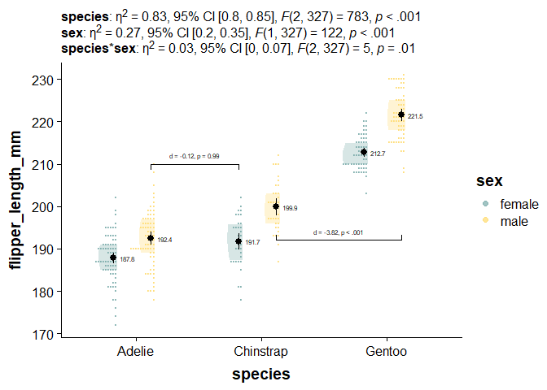
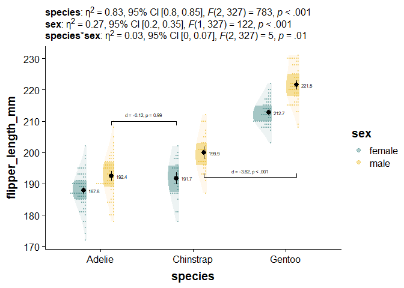

<!-- README.md is generated from README.Rmd. Please edit that file -->

# novahelpers

<!-- badges: start -->
<!-- badges: end -->

Dallas’s miscellanious helper functions, namely for summarizing and
reporting data.

## Installation

You can install the development version of novahelpers from
[GitHub](https://github.com/) with:

``` r
# install.packages("devtools")
devtools::install_github("DallasNovakowski/novahelpers")
```

## Usage

``` r
library(tidyverse)
library(emmeans)
library(palmerpenguins) # dataset

library(novahelpers)
```

Load data

``` r
df <- palmerpenguins::penguins

# drop rows with missing values
df <- df[complete.cases(df)==TRUE, ]
```

## make_summary()

Summarizes our relevant descriptive stats

``` r
flipper_summary <- make_summary(data = df, dv = flipper_length_mm, grouping1 = species, grouping2 = sex)

knitr::kable(flipper_summary)
```

| species   | sex    |     mean | min | max |   n |  std_dev |        se |    y25 |   y50 |    y75 |     loci |     upci |
|:----------|:-------|---------:|----:|----:|----:|---------:|----------:|-------:|------:|-------:|---------:|---------:|
| Adelie    | female | 187.7945 | 172 | 202 |  73 | 5.595035 | 0.6548493 | 185.00 | 188.0 | 191.00 | 186.5110 | 189.0780 |
| Adelie    | male   | 192.4110 | 178 | 210 |  73 | 6.599317 | 0.7723917 | 189.00 | 193.0 | 197.00 | 190.8971 | 193.9248 |
| Chinstrap | female | 191.7353 | 178 | 202 |  34 | 5.754096 | 0.9868194 | 187.25 | 192.0 | 195.75 | 189.8011 | 193.6695 |
| Chinstrap | male   | 199.9118 | 187 | 212 |  34 | 5.976559 | 1.0249713 | 196.00 | 200.5 | 203.00 | 197.9028 | 201.9207 |
| Gentoo    | female | 212.7069 | 203 | 222 |  58 | 3.897857 | 0.5118136 | 210.00 | 212.0 | 215.00 | 211.7037 | 213.7101 |
| Gentoo    | male   | 221.5410 | 208 | 231 |  61 | 5.673252 | 0.7263855 | 218.00 | 221.0 | 225.00 | 220.1173 | 222.9647 |

Running ANOVA, nothing i take credit for.

``` r
# basic fit
# Setting contrasts
contrasts(df$species) <- contr.sum

contrasts(df$sex) <- contr.sum

# Type 3 anova with orthogonal contrasts
flipper_fit <- lm(flipper_length_mm ~ species*sex, data = df)

flipper_anova <- car::Anova(flipper_fit, type = 3)

flipper_emmeans <- emmeans::emmeans(flipper_fit, specs = pairwise ~ species*sex)
```

## merge_emmeans_summary()

Combines our `make_summary()` output with `emmeans` object

``` r
flipper_summary <- merge_emmeans_summary(flipper_summary, flipper_emmeans)
knitr::kable(flipper_summary)
```

| species   | sex    |     mean | min | max |   n |  std_dev |        se |    y25 |   y50 |    y75 |     loci |     upci |   emmean | emmean_se | emmean_loci | emmean_upci |
|:----------|:-------|---------:|----:|----:|----:|---------:|----------:|-------:|------:|-------:|---------:|---------:|---------:|----------:|------------:|------------:|
| Adelie    | female | 187.7945 | 172 | 202 |  73 | 5.595035 | 0.6548493 | 185.00 | 188.0 | 191.00 | 186.5110 | 189.0780 | 187.7945 | 0.6618982 |    186.4924 |    189.0966 |
| Adelie    | male   | 192.4110 | 178 | 210 |  73 | 6.599317 | 0.7723917 | 189.00 | 193.0 | 197.00 | 190.8971 | 193.9248 | 191.7353 | 0.9698693 |    189.8273 |    193.6433 |
| Chinstrap | female | 191.7353 | 178 | 202 |  34 | 5.754096 | 0.9868194 | 187.25 | 192.0 | 195.75 | 189.8011 | 193.6695 | 212.7069 | 0.7425722 |    211.2461 |    214.1677 |
| Chinstrap | male   | 199.9118 | 187 | 212 |  34 | 5.976559 | 1.0249713 | 196.00 | 200.5 | 203.00 | 197.9028 | 201.9207 | 192.4110 | 0.6618982 |    191.1088 |    193.7131 |
| Gentoo    | female | 212.7069 | 203 | 222 |  58 | 3.897857 | 0.5118136 | 210.00 | 212.0 | 215.00 | 211.7037 | 213.7101 | 199.9118 | 0.9698693 |    198.0038 |    201.8197 |
| Gentoo    | male   | 221.5410 | 208 | 231 |  61 | 5.673252 | 0.7263855 | 218.00 | 221.0 | 225.00 | 220.1173 | 222.9647 | 221.5410 | 0.7240820 |    220.1165 |    222.9654 |

## calculate_and_merge_effect_sizes()

Merges raw comparisons and statistical tests with cohen’s d effect
sizes. Currently only does all tukey-adjusted comparisons

``` r
flipper_contrasts  <- calculate_and_merge_effect_sizes(flipper_emmeans, flipper_fit)
#> Since 'object' is a list, we are using the contrasts already present.

knitr::kable(flipper_contrasts)
```

| contrast                          |    estimate |        SE | df_error |     t.ratio |         p |          d |      d_se |   d_ci_low |  d_ci_high |
|:----------------------------------|------------:|----------:|---------:|------------:|----------:|-----------:|----------:|-----------:|-----------:|
| Adelie female - Chinstrap female  |  -3.9407736 | 1.1742043 |      327 |  -3.3561226 | 0.0113141 | -0.6968332 | 0.2094108 | -1.1087955 | -0.2848709 |
| Adelie female - Gentoo female     | -24.9123760 | 0.9947476 |      327 | -25.0439178 | 0.0000000 | -4.4051682 | 0.2461951 | -4.8894943 | -3.9208420 |
| Adelie female - Adelie male       |  -4.6164384 | 0.9360655 |      327 |  -4.9317473 | 0.0000191 | -0.8163086 | 0.1685709 | -1.1479290 | -0.4846883 |
| Adelie female - Chinstrap male    | -12.1172442 | 1.1742043 |      327 | -10.3195367 | 0.0000000 | -2.1426498 | 0.2238977 | -2.5831115 | -1.7021881 |
| Adelie female - Gentoo male       | -33.7464631 | 0.9810219 |      327 | -34.3992957 | 0.0000000 | -5.9672688 | 0.2907559 | -6.5392570 | -5.3952806 |
| Chinstrap female - Gentoo female  | -20.9716024 | 1.2214990 |      327 | -17.1687430 | 0.0000000 | -3.7083350 | 0.2601543 | -4.2201223 | -3.1965476 |
| Chinstrap female - Adelie male    |  -0.6756648 | 1.1742043 |      327 |  -0.5754235 | 0.9925701 | -0.1194754 | 0.2076830 | -0.5280388 |  0.2890879 |
| Chinstrap female - Chinstrap male |  -8.1764706 | 1.3716023 |      327 |  -5.9612547 | 0.0000001 | -1.4458166 | 0.2490378 | -1.9357351 | -0.9558982 |
| Chinstrap female - Gentoo male    | -29.8056895 | 1.2103475 |      327 | -24.6257285 | 0.0000000 | -5.2704356 | 0.2971169 | -5.8549373 | -4.6859339 |
| Gentoo female - Adelie male       |  20.2959376 | 0.9947476 |      327 |  20.4031038 | 0.0000000 |  3.5888595 | 0.2250201 |  3.1461898 |  4.0315293 |
| Gentoo female - Chinstrap male    |  12.7951318 | 1.2214990 |      327 |  10.4749425 | 0.0000000 |  2.2625183 | 0.2334102 |  1.8033432 |  2.7216935 |
| Gentoo female - Gentoo male       |  -8.8340871 | 1.0371635 |      327 |  -8.5175452 | 0.0000000 | -1.5621007 | 0.1933027 | -1.9423745 | -1.1818268 |
| Adelie male - Chinstrap male      |  -7.5008058 | 1.1742043 |      327 |  -6.3879905 | 0.0000000 | -1.3263412 | 0.2140100 | -1.7473513 | -0.9053311 |
| Adelie male - Gentoo male         | -29.1300247 | 0.9810219 |      327 | -29.6935513 | 0.0000000 | -5.1509602 | 0.2658223 | -5.6738977 | -4.6280226 |
| Chinstrap male - Gentoo male      | -21.6292189 | 1.2103475 |      327 | -17.8702550 | 0.0000000 | -3.8246190 | 0.2610972 | -4.3382611 | -3.3109768 |

``` r
# Extract effect size (partial eta squared) from anova
flipper_anova_pes <- effectsize::eta_squared(flipper_anova,
                                             alternative="two.sided",
                                             verbose = FALSE)
# Convert anova table into dataframe
flipper_anova <- data.frame(flipper_anova)


flipper_anova <- flipper_anova[!(rownames(flipper_anova) == "(Intercept)"), ]

# import effect size estimates and confidence intervals to anova dataframe
flipper_anova[1:3,"pes_ci95_lo"] <- flipper_anova_pes$CI_low
flipper_anova[1:3,"pes_ci95_hi"] <- flipper_anova_pes$CI_high
flipper_anova[1:3,"pes"] <- flipper_anova_pes$Eta2

# round all numeric columns to 2 decimal places
flipper_anova <- flipper_anova %>%
  dplyr::mutate_if(is.numeric, function(x) round(x, 2))
```

## report_tidy_anova_etaci()

Used for extracting results from anova table into reportable text

``` r
report_tidy_anova_etaci(flipper_anova, "sex")
#> [1] "<U+03B7>^2^ = 0.27, 95% CI [0.2, 0.35], *F*(1, 327) = 122, *p* < .001"
```

You can use this inline function inline as well, η<sup>2</sup> = 0.27,
95% CI \[0.2, 0.35\], *F*(1, 327) = 122, *p* \< .001

## report_tidy_t()

``` r
flipper_sex_ttest <- t.test(flipper_length_mm ~ sex, data=df) %>%
  report::report() %>%
  data.frame() %>%
  janitor::clean_names()
#> Warning: Unable to retrieve data from htest object.
#>   Returning an approximate effect size using t_to_d().

knitr::kable(flipper_sex_ttest)
```

| parameter         | group | mean_group1 | mean_group2 | difference |   ci |    ci_low |   ci_high |         t | df_error |       p | method                  | alternative |          d |   d_ci_low |  d_ci_high |
|:------------------|:------|------------:|------------:|-----------:|-----:|----------:|----------:|----------:|---------:|--------:|:------------------------|:------------|-----------:|-----------:|-----------:|
| flipper_length_mm | sex   |    197.3636 |     204.506 |  -7.142316 | 0.95 | -10.06481 | -4.219821 | -4.807866 | 325.2784 | 2.3e-06 | Welch Two Sample t-test | two.sided   | -0.5331566 | -0.7539304 | -0.3115901 |

``` r

report_tidy_t(flipper_sex_ttest, teststat = T)
#> [1] "*d* = -0.53, 95% CI [-0.75, -0.31], *t* (325.28) = -4.81, *p* < .001"
```

Works on t-tests, *d* = -0.53, 95% CI \[-0.75, -0.31\], *t* (325.28) =
-4.81, *p* \< .001

… and it works on emmmean contrasts from ANOVA, *d* = -0.82, 95% CI
\[-1.15, -0.48\], *p* \< .001

``` r
report_tidy_t(
                           flipper_contrasts[flipper_contrasts$contrast =="Adelie female - Adelie male",], 
                           italicize = FALSE, 
                           ci = FALSE)
#> [1] "d = -0.82, p < .001"
```

# Putting it Together With a Plot, with theme_basic()

``` r
#Just for this plotting workflow
library(ggpp) # for position_dodge2nudge
library(cowplot)
library(ggdist)
library(ggpubr) # significance brackets
library(ggtext)

# Define color palette
nova_palette <- c("#78AAA9", "#FFDB6E")

ggplot(data = df,
       aes(y = flipper_length_mm, # our dependent/response/outcome variable 
           x = species,  # our grouping/independent/predictor variable
           fill = sex)) +  # our third grouping/independent/interaction variable
    ggdist::stat_slab( alpha = .3,
                     adjust = 2,
                     side = "left", 
                     scale = 0.4, 
                     show.legend = F, 
                     position = position_dodge(width = .6), 
                     .width = c(.50, 1),
                     aes(fill_ramp = after_stat(level))) +
  ## Add stacked dots
  ggdist::stat_dots(alpha = 0.7,
                    side = "left", 
                    scale = 0.4, 
                    aes(color = sex,
                    fill = sex),

                    position = position_dodge(width = .6)) + 
  geom_text(data = flipper_summary, 
            aes(x = species, 
                y = mean, 
                label = round(mean,1)),
            color="black", 
            size = 2, 
            position = position_dodge2nudge(x = .08, width = .6)) +
    geom_pointrange(data = flipper_summary, # our externally-defined summary dataframe
                  aes(x = species,  # our independent variable
                      y = mean, # our outcome/dependent variable
                      ymin = loci,  # lower-bound confidence interval
                      ymax = upci # upper-bound confidence interval
                  ), 
                  show.legend = F,
                  position = position_dodge2nudge(x= -.03, width = .6)) +
  
  
    scale_colour_manual(values = nova_palette, 
                              aesthetics = c("fill", "color")) +   
  ## define amount of fading
ggdist::scale_fill_ramp_discrete(range = c(0.0, 1),
                                   aesthetics = c("fill_ramp")) + 
       labs(subtitle = paste0("**species**: ", report_tidy_anova_etaci(flipper_anova,"species"), "<br>",
                           "**sex**: ", report_tidy_anova_etaci(flipper_anova,"sex"), "<br>",
                           "**species*sex**: ",report_tidy_anova_etaci(flipper_anova,"species:sex"))
         ) + # add a density slab

  
  ggpubr::geom_bracket(inherit.aes = FALSE, # necessary for factorial design
                       tip.length = 0.02, 
                       vjust = -0.6,
                       xmin = 1.12, # You need to play with these by hand
                       xmax = 1.82, 
                       y.position = 210 ,
                       label.size = 2.1,
                       label = paste0(
                         report_tidy_t(
                           flipper_contrasts[flipper_contrasts$contrast =="Chinstrap female - Adelie male",], 
                           italicize = FALSE, 
                           ci = FALSE)) # content of your bracket text
                       
  ) +
  ggpubr::geom_bracket(inherit.aes = FALSE, 
                       tip.length = -0.02, 
                       vjust = 0.3,
                       xmin = 2.12, 
                       xmax = 3.12, 
                       y.position = 192 ,
                       label.size = 2.1,
                       label = paste0(
                         report_tidy_t(
                           flipper_contrasts[flipper_contrasts$contrast =="Chinstrap male - Gentoo male",], 
                           italicize = FALSE, 
                           ci = FALSE)) # content of your bracket text
  ) +

  theme_basic() +
  guides(fill_ramp = "none")
```



For posterity, here is a plot with just faded density slabs

``` r

ggplot(data = df,
       aes(y = flipper_length_mm, # our dependent/response/outcome variable 
           x = species,  # our grouping/independent/predictor variable
           fill = sex)) +  # our third grouping/independent/interaction variable
    ggdist::stat_slab(
                     adjust = 2,
                     side = "left", 
                     scale = 0.4, 
                     show.legend = F, 
                     position = position_dodge(width = .6), 
                     .width = c(.50, 1),
                     aes(fill_ramp = after_stat(level))) +
  ggdist::scale_fill_ramp_discrete(range = c(0.3, 1),
                                   aesthetics = c("fill_ramp")) + 
      scale_colour_manual(values = nova_palette, 
                              aesthetics = c("fill")) +   

  geom_text(data = flipper_summary, 
            aes(x = species, 
                y = mean, 
                label = round(mean,1)),
            color="black", 
            size = 2, 
            position = position_dodge2nudge(x = .08, width = .6)) +
    geom_pointrange(data = flipper_summary, # our externally-defined summary dataframe
                  aes(x = species,  # our independent variable
                      y = mean, # our outcome/dependent variable
                      ymin = loci,  # lower-bound confidence interval
                      ymax = upci # upper-bound confidence interval
                  ), 
                  show.legend = F,
                  position = position_dodge2nudge(x= -.03, width = .6)) + 
  theme_basic()
```


